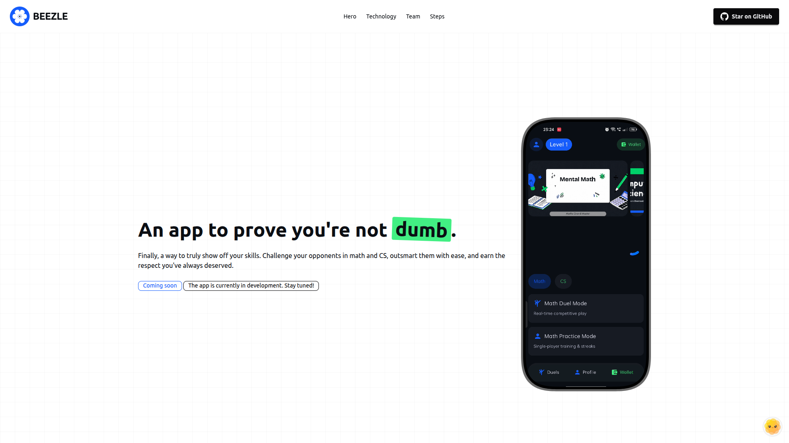

<div align="center">



<div>
<h1>beezle.app <span></span></h1>
</div>

Landing page for the Beezle app, built with React, Typescript, Vite, Tailwind CSS, and DaisyUI.

[](LICENSE.md)

> ⚠️ **Warning:** This website is currently under active development. Commit messages, pushed changes, and features may be unstable.

</div>

---

## Quick start

Prerequisites:

- Node.js 18+ (Node 22 LTS recommended)
- npm

Install dependencies and start the dev server:

```bash
npm install
npm run dev
```

Build for production:

```bash
npm run build
```

output will be in `dist/`.

## Customization

### Theme colors (DaisyUI + Tailwind)

Theme lives in `src/index.css` via DaisyUI plugins. Update colors to match your brand:

https://daisyui.com/docs/themes/

```css
@plugin "daisyui" {
  themes: light;
}
@plugin "daisyui/theme" {
  name: "light";
  default: true;
  --color-primary: #155dfc;
  --color-base-content: #0b0e13;
}
```

> **Note:** Currently light theme is being used, dark mode with toggle button will be added later.

### Hero background patterns

The hero supports two Tailwind-based patterns and an optional radial mask. Switch patterns by passing a prop to `Hero`:

```tsx
// src/pages/Home.tsx
// defaults to pattern="grid" withmask set to false.
// Examples:
// <Hero pattern="grid" />
// <Hero pattern="dots" />
// <Hero pattern="grid" withMask={false} />
```

credits => [Rifky Alfarez](https://dev.to/rifkyalfarez/how-to-create-grid-and-dots-background-using-tailwind-css-1jkb)

### Assets

- Replace images in `src/assets/logo`, `src/assets/techstack`, etc., as needed.
- Update `public/` for any static files you want served at the root.

## Commands

- `npm run dev` - start Vite dev server
- `npm run build` - build for production
- `npm run lint` - run ESLint

## Deployment

This is a static website hosted on **Hostinger** with domain from **name.com**.

### 🌐 Domain & Hosting Setup

#### DNS Configuration

To connect your domain to Hostinger:

1. Log in to your domain provider.
2. Go to **My Domains**
3. Update **Nameservers** to Hostinger's DNS:
   - Check your Hostinger dashboard for exact nameserver addresses
   - Typically: `ns1.dns-parking.com`, `ns2.dns-parking.com`
4. DNS propagation takes up to 24 hours

### 🚀 Automated Deployment

This project uses **GitHub Actions** for automatic deployment. Every push to `main` triggers:

1. **Build** - `npm ci` and `npm run build` (Node.js 22)
2. **Deploy** - Transfer `dist/` to `~/domains/beezle.app/public_html/` via SSH
3. **Live** - Website updates at [beezle.app](https://beezle.app)

### ⚙️ Initial Setup (One-time)

If setting up deployment from scratch:

#### 1. Generate SSH Key

```bash
ssh-keygen -t rsa -b 4096 -C "github-deployment" -f ~/.ssh/hostinger_deploy
```

#### 2. Add Public Key to Hostinger

```bash
cat ~/.ssh/hostinger_deploy.pub
```

- Log in to Hostinger hPanel
- Go to **Advanced** --> **SSH Access**
- Click **Add SSH Key** and paste the public key

#### 3. Add GitHub Secrets

Repository **Settings** --> **Secrets and variables** --> **Actions** --> **Repository Secret**:

| Secret            | Value                                                    |
| ----------------- | -------------------------------------------------------- |
| `SSH_HOST`        | `IP_ADDRESS`                                             |
| `SSH_USERNAME`    | `u*********`                                             |
| `SSH_PRIVATE_KEY` | Contents of `~/.ssh/hostinger_deploy` (full private key) |

#### 4. Create Workflow File

The deployment workflow is in `.github/workflows/deploy.yml`:

#### 5. Push to `main` to trigger deployment:

```bash
git add .
git commit -m "your message"
git push origin main
```

---

<div align="center">

**Live at** [beezle.app](https://beezle.app) • Built using React + Vite

</div>
